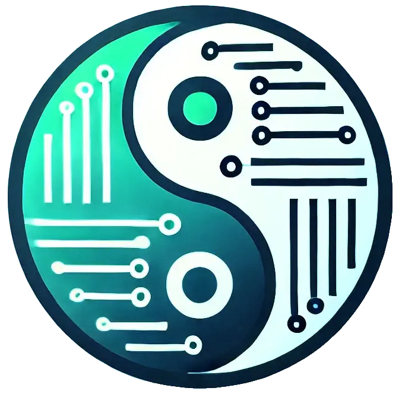

# Parens From The Past: A Laconic Odyssey

<table style="width: 100%;">
  <tr>
    <td style="width: 50%; padding-right: 1em; text-align: center;">
      
    </td>
    <td style="width: 50%; padding-left: 1em; vertical-align: middle;">
      <blockquote>
        
Laconic

        
/ləˈkɒnɪk/

        
adjective

         
        
Expressing much in few words; brief and pithy; concise to the point of seeming mysterious.

      </blockquote>
    </td>
  </tr>
</table>

## Overview

**Parens from the Past: A Laconic Odyssey** is a reality-based science fiction novel that introduces the reader to the world of computer programming, illustrates the creative possibilities of computer programming as a medium of expression, and inspires the reader to investigate computer programming further and create their own expressions. The novel attempts to demystify programming in general, encourages readers to experiment with Clojure, and celebrates human creativity in the context of respectful, meaningful dialogue.

It's perspective on computer programming is:

Programming is the art of telling a machine what to do in a language that is simultaneously a mathematical proof, a philosophical argument, a linguistic utterance, an engineered artifact, and a story worth reading.

## Technology

### Writing the Novel

One of the goals of the novel is to "**Clojure All The Things**," which expresses the idea of pushing the use of Clojure, including its dialects and tools (e.g., babashka, Clay, Hiccup, Calva), as far as possible. This philosophy draws inspiration from the C++ community's slogan "**constexpr All The Things**," emphasizing maximal use of compile-time computation, adapted here to connote the idea of maximizing Clojure's expressive power.

The novel is authored using **Clojure**, a functional programming language known for its laconic nature. It employs a **literate programming** approach, pioneered by Donald Knuth, where narrative text and code are interwoven seamlessly in notebook files.

- **Clay**: A Clojure library for creating literate-programming-style notebooks and documents. The content resides in the `notebooks/` directory as `.clj` files, blending prose with executable Clojure code to illustrate concepts dynamically. [GitHub](https://github.com/scicloj/clay) | [Documentation](https://scicloj.github.io/clay/)

### Rendering the Novel
The notebooks are rendered into a static website using **Quarto**, a multi-format publishing system.

- **Clay Configuration** (`clay.edn`): 
  - Processes notebooks from `notebooks/` into Quarto Markdown (`.qmd`) files.
  - Outputs HTML to the `docs/` directory.
  - Features: Hides most code blocks by default for a narrative focus.

This configuration allows the novel to be read as an interactive, web-based book, with multiple chapters each generating corresponding `.html` files. The rendering emphasizes readability while preserving the educational and philosophical essence of the content.

### Tooling
- **Babashka**: A fast-starting, scripting-oriented Clojure dialect designed for command-line and automation tasks without requiring the JVM.
- **Calva**: A Clojure extension for VS Code, providing REPL integration and code editing support.
- **Calva Power Tools**: Extensions enhancing Calva's capabilities for advanced Clojure development.
- **Cline**: An AI assistant extension for VS Code, aiding in software development tasks with natural language understanding capabilities.
