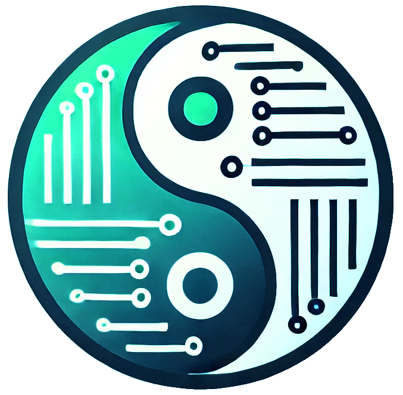

# cljonic

**Header-Only Embedded-Systems C++ Clojure-esque Functional Programming Library**

<p align="center">
  
</p>

> **Note:**  
> If you are interested in a “big-machine” **C++ Clojure** implementation, see the [Jank project](https://github.com/jank-lang/jank).

> **Important:**  
> I am **NOT** a *Modern C++* expert.  
> I’m learning *Modern C++*, especially *Concepts*, using *GitHub Copilot*.  
> I am moderately competent in *Clojure*, having used it professionally for several years.  
> If you have suggestions for improvement, **please** feel free to create issues, and I’ll **do my best** to address them. **PRs** are also welcome.

---

## Pronunciation

**cljonic** */klə-jŏn′ĭk/*

---

## Obligatory Word Definition

**Laconic**

- Expressing much in few words; brief and pithy; concise; brusque

---

## Detailed Documentation

Detailed documentation is available [here](https://thecodesojourner.github.io/cljonic/).

---

## Motivation

> **John Carmack** — [In-depth Functional Programming in C](https://www.gamedeveloper.com/programming/in-depth-functional-programming-in-c-)  
> 
> “A large fraction of the flaws in software development are due to programmers not fully understanding all the possible states their code may execute in. ... Programming in a functional style makes the state presented to your code explicit, which makes it much easier to reason about (i.e., fewer mistakes, and less debugging).  
>  
> No matter what language you work in, programming in a functional style provides benefits. You should do it whenever it is convenient, and you should think hard about the decision when it isn’t convenient.”

---

**Clojure** is one of the most expressive and concise programming languages. It is *laconic* in nature, *immutable-by-default*, *practical*, and *stable*.  
*Clojure* is based on the *Lisp* programming language. However, it is not well suited for some domains, such as *embedded systems* with tight memory and CPU constraints that disallow *heap* usage and only offer *C++* programming tools.

**C++**, on the other hand, is quite different. It tends to be *verbose* rather than *laconic*.  
*C++* is not immutable-by-default and is not considered a functional programming language, though it has some functional features like *lambdas*, *ranges*, *views*, *optional*, and *expected*.  
*C++* is a *BIG* and constantly evolving language with a large and growing feature set—it offers many ways to do things, some of which make it easy to do things poorly.

Most *embedded system developers* are not language experts. They often don’t have time to keep up with the latest *C++* features, and their education may not emphasize deep understanding of *Modern C++*.  
They are usually *self-taught*, learning on the job.

Some *embedded system* projects do not require heavy use of advanced *C++* performance features.  
Many projects contain a small portion of *finely tuned* code and a large portion that is *not performance critical*.

The motivation behind **cljonic** is to provide a *Clojure-esque* functional programming library for *C++* embedded system developers.  
It aims to be *laconic*, *immutable-by-default*, *practical*, and *stable*.  
*cljonic* should be *easy to learn, understand, and use properly* for *safe* and *efficient* implementation of embedded systems.

---

## Desired Developer Experience When Using cljonic

Developers using **cljonic** should be able to write *safe* code that is *easy to read, understand, and maintain*.  
These goals will help embedded system projects be *completed more quickly*, with *fewer bugs*, and be *easier to maintain* over time.

### Default Element

Every **cljonic collection** has a **default element**, returned whenever a valid collection element cannot be.  
The value of a collection’s default element is a default-initialized instance of the element type (`T{}`), avoiding exceptions and error codes.

> **Note:**  
> Because of this design, *cljonic* users must take care to know when a *default element* can be returned (e.g., asking for the first element of an empty collection) and handle that appropriately.

### constexpr

**cljonic** uses `constexpr` whenever possible to enable **compile-time evaluation** of expressions and to help detect *undefined behavior* early.

---

## Developer Experience When Developing cljonic

**cljonic** includes a **Makefile** in the root directory.  
Run `make` from the command line to see available development options.

After cloning the repository:

1. Run `make all`
2. Then, after modifying files (but not adding new ones), run `make test`
3. If all tests pass, run `make cljonic` to generate the single header file
4. Finally, run `make git` to prepare for a git commit

> **Note:**  
> If you add new files to `code/source` or `code/test`, run `make all` again.  
>  
> If you add new function files to `code/source`, update:
> - `code/source/cljonic-pre-declarations.hpp`
> - `scripts/make-cljonic.sh`
> - `resources/no-dynamic-memory.cpp`

---

## Implementation Characteristics

> **Note:**  
> Performance should be acceptable if the *average collection size is small* and *cljonic* is used for *non-performance-critical code*.

- To provide *immutability-by-default* without heap usage, **cljonic** uses **copying**.  
- For safety, **bounds-checking** is performed on all collection accesses.  
- To control memory usage, **cljonic** defines `CLJONIC_COLLECTION_MAXIMUM_ELEMENT_COUNT` (default: 1000).  
  You can override it, e.g.:

  ```cpp
  #define CLJONIC_COLLECTION_MAXIMUM_ELEMENT_COUNT 10000
  #include "cljonic.hpp"
  ```

  or via compiler/build-tool definitions.

---

## Required Resources

- **AsciiDoc** for project documentation  
  [https://asciidoctor.org/docs/asciidoc-writers-guide/](https://asciidoctor.org/docs/asciidoc-writers-guide/)
- **C++20** (or higher) for Modern C++ features  
- **catch** v2.13.9 for testing  
- **clang-format** for code formatting  
- **cppcheck** for code analysis  
- **doxygen** for code documentation  
- **gcov** for code coverage analysis  
- **genhtml** for code coverage visualization  
- **lcov** for code coverage analysis  
- **lizard** for code metrics  
  - [https://github.com/terryyin/lizard](https://github.com/terryyin/lizard)  
  - *Note:* Lizard only supports C++14. Another tool supporting Cyclomatic Complexity and Function LoC would be better.
- **valgrind** for code analysis
